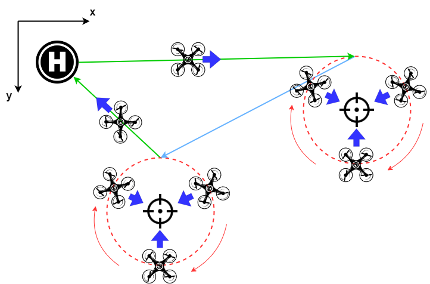
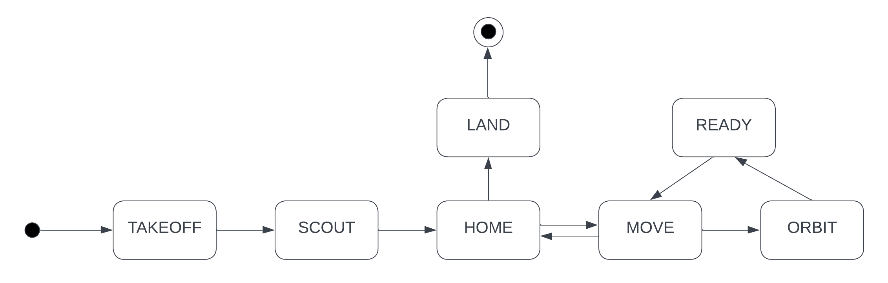

# ROS2 Package for Drone Orbit

This repository contains a ROS2 package to simulation an orbit movement for a drone.

The scripts are ran in the `px4_simulator_container` found in this gitlab repository [here](https://gitlab.gbar.dtu.dk/DTU-AUT/34757-uas/px4_simulator_container), which uses Ubuntu 20.04, ROS2 Galatic, Micro-XRCE Agent, PX4 and Gazebo.

The scripts were tested using software-in-the-loop (SITL). NED coordinate system is used in the code.

## Description of Path



A video of the simulation demo can be found [on YouTube here](https://youtu.be/A16FTK1mKx8).

The drone will perform a clockwise orbit about the boat position, facing inwards towards the centre. It will start the orbit from the position `(x+ORBIT_RADIUS, y)`. Boat positions are added to `boat_queue` and the drone goes to the boat at the start of the queue

`cmd_timer_callback` runs like a state machine to command the drone at different stages of the mission.



## Build the ROS2 package

Start the px4 simulator container

```bash
cd px4_simulator_container
./launch_container.sh
```

Change directory into the ROS2 workspace

```bash
cd ~/ros_ws/src
```

Add SSH key to your github account. Follow instructions [here](https://docs.github.com/en/authentication/connecting-to-github-with-ssh/generating-a-new-ssh-key-and-adding-it-to-the-ssh-agent).

View the generated public key.

```bash
cat ~/.ssh/id_ed25519.pub
```

Clone the repository

```bash
git clone git@github.com:yufanana/drone_orbit.git
```

Build with colon

```bash
colcon build
```

Alternatively, only build specific packages that were modified.

```bash
colcon build --packages-select <name-of-pkg>
```

Source the setup file

```bash
source /ros_ws/install/setup.bash
```

## Running the package

Start the px4 simulation container

```bash
cd px4_simulator_container
./launch_container.sh
```

Run tmux to have multiple terminals ([tmux cheatsheet](https://tmuxcheatsheet.com/)).

```bash
tmux
```

Source the setup file in each new terminal session

```bash
source /ros_ws/install/setup.bash
```

Run software-in-the-loop, brings up Gazebo.

```bash
./start_sitl.sh
```

In 2 new terminals,
- run the offboard control node that commands the drone movements

```bash
ros2 run drone_orbit offboard_orbit
```

- run the boat publisher node to output the boat positions

```bash
ros2 run drone_orbit boat_publisher
```

In the terminal for the `boat_publisher`, enter dummy numerical values to introduce target positions for the drone to travel to.

```bash
Enter boat XY-position: <x> <y>
```
